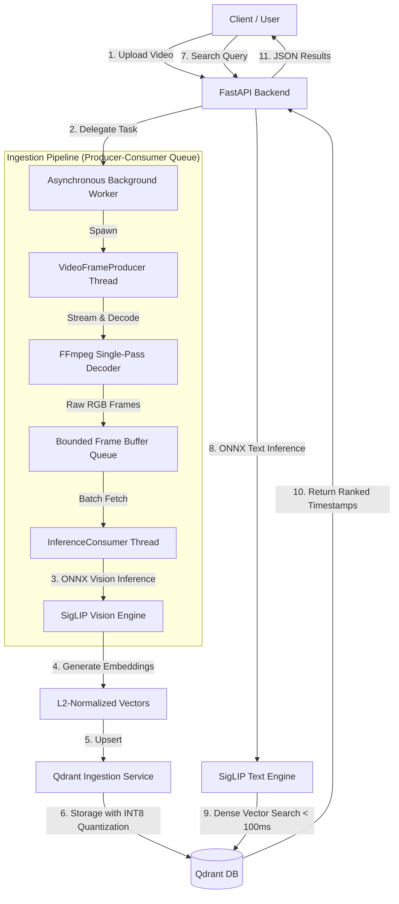

# Semantic Video Search Engine

> High-performance semantic search across videos using natural language.
> Powered by **Google SigLIP**, **ONNX Runtime**, and **Qdrant**.  optimized for CPU execution.

---

## Overview

This project is a resource efficient video search engine that enables users to search video content using natural language queries such as:

* *"A cat playing with red ball in swimming pool"*
* *"A young girl cooking pasta"*
* *"A man in black Suit walking on road"*


The system extracts semantic embeddings from video frames using **SigLIP**, stores them in **Qdrant**, and retrieves matching timestamps in milliseconds.

Designed for low resource environments, the entire pipeline runs efficiently on commodity CPUs with **zero GPU dependency** while maintaining high ingestion throughput.

---


# Performance Benchmarks

## End-to-End Ingestion Speed

| Video Type  | Size   | Processing Time |
| ----------- | ------ | --------------- |
| 1080p Video | 950 MB | ~9 minutes      |
| 480p Video  | 300 MB | ~3 minutes      |

 **Tested on intel i5 7th gen 7300U CPU with NO GPU*


## Runtime Characteristics

* **Search latency:** `< 100ms`
* **Execution provider:** ONNX Runtime CPU EP
* **GPU requirement:** None
* **Baseline hardware:** Intel Core i5-7300U @ 3.2 GHz

---

# System Architecture



---

# Architectural Pillars

## 1. Asynchronous Bounded Pipeline

A concurrent producer-consumer architecture decouples:

* frame decoding (FFmpeg / CPU)
* embedding generation (ONNX inference)

A bounded queue (`64 frames`) ensures:

* low memory overhead
* stable throughput
* controlled backpressure

---

## 2. Single-Pass Smart Frame Extraction

Frames are decoded exactly once using FFmpeg.

Scene change filtering:

```bash
select='gt(scene,0.12)'
```

eliminates redundant frames before inference, resulting in:

* significantly lower compute usage
* improved semantic diversity
* ~6–8× higher throughput compared to uniform frame sampling

---

## 3. Split ONNX Inference + INT8 Quantization

The SigLIP model is:

* quantized to INT8
* split into dedicated vision and text encoders

### Vision Encoder

Used only during ingestion.

### Text Encoder (~26 MB)

Loaded only during search requests.

### Result

* ~50% faster execution
* reduced memory usage
* lower startup overhead

---

## 4. Memory-Mapped Vector Storage

Qdrant stores FP32 vectors using memory-mapped storage (MMAP), while keeping only the quantized INT8 index in RAM.

Benefits:

* minimal RAM usage
* scalable indexing
* high recall retention

---

# Repository Structure

```text
├── app/
│   ├── api/             # FastAPI routes & endpoint definitions
│   ├── core/            # Configurations & settings
│   ├── engine/          # Pipeline & inference logic
│   ├── services/        # Qdrant interactions & background tasks
│   └── utils/           # Hardware detection & utilities
│
├── db/                  # Qdrant setup scripts
├── inference/           # Standalone inference implementations
├── models/              # Quantized ONNX models
├── tools/               # Quantization & model split scripts
│
├── app.py               # Interactive CLI utility
├── docker-compose.yml   # Multi-container orchestration
└── Dockerfile           # Optimized backend container
```

---


# Key Highlights

| Feature                  | Details                               |
| ------------------------ | ------------------------------------- |
| ⚡ Query Latency          | **< 100ms**                           |
| 🧠 Embedding Model       | **Google SigLIP**                     |
| 🖥️ Hardware Requirement | CPU Only                              |
| 📦 Vector Database       | Qdrant                                |
| 🔍 Search Type           | Natural Language Semantic Search      |
| 🚀 Runtime               | ONNX Runtime                          |
| 🧵 Architecture          | Concurrent Producer–Consumer Pipeline |
| 💾 Optimization          | INT8 Quantization + MMAP Storage      |

---


# Tech Stack

## Backend

* Python 3.12
* FastAPI
* Uvicorn

## AI / Inference

* ONNX Runtime
* HuggingFace Transformers
* Google SigLIP

## Computer Vision

* FFmpeg
* PyAV
* Pillow
* NumPy

## Database

* Qdrant
* HNSW Index
* INT8 Scalar Quantization

## Infrastructure

* Docker
* Docker Compose

---

# Getting Started

Clone the repository:

```bash
git clone https://github.com/aditya_sri004/Semantic_Video_Search.git
cd Semantic_Video_Search
```

---

# Deployment Options

## Option A — Docker Compose (Recommended)

Run the complete stack including backend + Qdrant.

### Start Services

```bash
docker-compose up --build -d
```

### Access API Docs

```text
http://localhost:8000/docs
```

---

## Option B — Local Development

Ideal for debugging and experimentation.

### 1. Install Dependencies

Ensure `ffmpeg` is installed and available in PATH.

```bash
pip install -r requirements.txt
```

---

### 2. Start Qdrant

```bash
docker run -d -p 6333:6333 -p 6334:6334 qdrant/qdrant
```

---

### 3. Create Qdrant Collection

```bash
python db/setup_collection.py
```

---

### 4. Quantize & Split Model

```bash
python tools/quantize_model.py
```

---

### 5. Start API Server

```bash
uvicorn app.main:app --reload
```

---

# API Endpoints

Swagger UI:

```text
http://localhost:8000/docs
```

## Core Endpoints

| Method | Endpoint             | Description                   |
| ------ | -------------------- | ----------------------------- |
| POST   | `/api/v1/upload`     | Upload and index video files  |
| POST   | `/api/v1/search`     | Perform semantic video search |
| GET    | `/api/v1/videos`     | List indexed videos           |
| DELETE | `/api/v1/video/{id}` | Delete indexed video          |
| GET    | `/api/v1/health`     | Health & diagnostics endpoint |

---

# Search Workflow

```text
Video Upload
    ↓
Frame Extraction
    ↓
Scene Filtering
    ↓
SigLIP Embeddings
    ↓
Qdrant Vector Storage
    ↓
Natural Language Search
    ↓
Timestamp Retrieval
```

---

# Design Goals

* Minimal hardware requirements
* Production-grade ingestion throughput
* Low memory footprint
* Fast semantic retrieval
* Fully CPU-compatible inference
* Modular and scalable architecture

---

## Author

Engineered by **aditya_sri004**

* **Please hit a star if you like this repository !**

#### License
This project is licensed under the GNU General Public License v3.0 - see the [LICENSE](https://github.com/Aniket-16-S/Semantic_Video_Search/blob/main/LICENSE) file for details.
